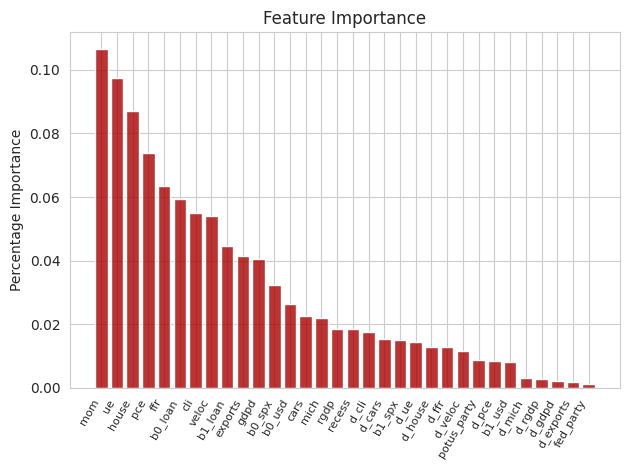
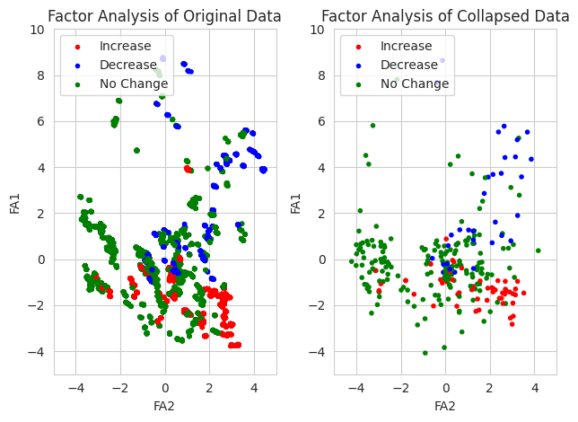

# Federal Funds Rate Prediction Model

## Overview

The Federal Reserve (Fed) is a United States governmental institution that serves to keep the national economy stable and under control. It is the most powerful and influential economic organization in the nation, tasked with promoting "maximum employment, stable prices, and moderate long-term interest rates". The Fed's mission is commonly referred to as the "dual mandate", highlighting its focus on employment and inflation, using long-term interest rates as a mechanism to achieve these objectives.

Changes in long-term interest rates, representing the cost of borrowing money, significantly impact personal expenditures and corporate investment. High interest rates encourage savings and deter investment, cooling the economy, while lower rates do the opposite. The most important long-term interest rate in the U.S. is the federal funds rate (FFR), set by the Fed to guide the economy.

## Research Objectives

The ability to predict changes in the FFR could enable optimal financial decisions. Despite various efforts, accurate prediction remains challenging under mixed economic conditions. Our objective is to develop a more robust model for predicting changes in the FFR using regression and classification techniques, focusing on features that best predict Federal Open Market Committee (FOMC) decisions.

## Our Data

We collected data from FRED, Yahoo! Finance, OECD, Wikipedia, and Dr. Kuttner's website, focusing on economic indicators continuously tracked from 1989 to the present day. Our selected features include Bank Prime Loan Rate Changes, Exports of Goods and Services, Personal Consumption Expenditures Rate, and several others detailed in the table below.

| Feature | Variable | Frequency | Description |
| --- | --- | --- | --- |
| Bank Prime Loan Rate Changes | `loan` | daily | Rate charged by banks for short-term loans to creditworthy debtors |
| Exports of Goods and Services | `export` | quarterly | Total dollar value of goods and services exported in the quarter |
| Personal Consumption Expenditures Rate | `pce` | monthly | Measure of core inflation for personal expenditures |
| Unemployment Rate | `ue` | monthly | Number of unemployed as a percentage of the labor force |
| Change in Real GDP | `rgdp` | quarterly | Quarterly change in inflation-adjusted GDP |
| Total Vehicle Sales | `cars` | monthly | Total number of vehicle sales in millions |
| Recession Indicator | `recess` | monthly | Binary variable indicating whether the US is in a recession |
| GDP Deflator | `gdpd` | daily | Price index given by ratio of nominal GDP to real GDP |
| Velocity of M1 Money | `veloc` | quarterly | Ratio of nominal GDP to the quarterly average of M1 money stock |
| New Private Housing Units Started | `house` | monthly | Number of new housing units beginning construction in millions  |

## Data Cleaning and Feature Engineering
Our data, obtained from diverse frequencies, was harmonized and processed to avoid "look-ahead" bias, filling gaps and using a collapse() function to align with FOMC announcement days. New features were introduced to capture trends, enhancing our dataset for analysis.

## Robustness
Our data processing pipeline is designed for ease of modification, supporting the addition of new features or FOMC decisions. This flexible framework ensures our model remains current and adaptable.

## Data Visualization and Basic Analysis
The historical analysis shows a 68% baseline accuracy for predicting FFR changes by always assuming no change. This sets the benchmark for our models. Charts and graphs, such as the change in FFR over time and factor analysis, provide visual insights into our data and model performance.

  
  

## Learning Algorithms and In-Depth Analysis
We explored various models, including RandomForestClassifier, XGBoostClassifier, Softmax Logistic Regression, and Gaussian Discriminant Analysis. Our findings indicate that RandomForestClassifier is the most effective, with an average accuracy of approximately 80%.

#### Average Accuracy Results:
- RandomForestClassifier – Average Accuracy: 0.81
- XGBoostClassifier – Average Accuracy: 0.79
- Softmax Logistic Regression – Average Accuracy: 0.75
- General Discriminant Analysis (GDA) – Average Accuracy: 0.68

#### Classification Reports:
**RandomForestClassifier – Classification Report:**

|       | precision | recall | f1-score | support |
|-------|-----------|--------|----------|---------|
| 0     | 0.82      | 0.42   | 0.56     | 33      |
| 1     | 0.80      | 0.96   | 0.87     | 188     |
| 2     | 0.87      | 0.49   | 0.63     | 53      |
|       |           |        |          |         |
| accuracy|          |        | 0.81     | 274     |
| macro avg| 0.83    | 0.63   | 0.69     | 274     |
| weighted avg| 0.81 | 0.81   | 0.79     | 274     |

**XGBoostClassifier – Classification Report:**

|       | precision | recall | f1-score | support |
|-------|-----------|--------|----------|---------|
| 0     | 0.76      | 0.39   | 0.52     | 33      |
| 1     | 0.78      | 0.96   | 0.86     | 188     |
| 2     | 0.88      | 0.43   | 0.58     | 53      |
|       |           |        |          |         |
| accuracy|          |        | 0.79     | 274     |
| macro avg| 0.81    | 0.60   | 0.66     | 274     |
| weighted avg| 0.80 | 0.79   | 0.77     | 274     |

**Softmax Logistic Regression – Classification Report:**

|       | precision | recall | f1-score | support |
|-------|-----------|--------|----------|---------|
| 0     | 0.68      | 0.39   | 0.50     | 33      |
| 1     | 0.78      | 0.88   | 0.83     | 188     |
| 2     | 0.63      | 0.51   | 0.56     | 53      |
|       |           |        |          |         |
| accuracy|          |        | 0.75     | 274     |
| macro avg| 0.70    | 0.60   | 0.63     | 274     |
| weighted avg| 0.74 | 0.75   | 0.74     | 274     |

**GDA – Classification Report:**

|       | precision | recall | f1-score | support |
|-------|-----------|--------|----------|---------|
| 0     | 0.44      | 0.55   | 0.49     | 33      |
| 1     | 0.83      | 0.69   | 0.75     | 188     |
| 2     | 0.49      | 0.72   | 0.58     | 53      |
|       |           |        |          |         |
| accuracy|          |        | 0.68     | 274     |
| macro avg| 0.59    | 0.65   | 0.61     | 274     |
| weighted avg| 0.72 | 0.68   | 0.69     | 274     |

### Ethical Implications

We have attempted to develop a model for predicting changes in the federal funds rate based on available economic indicators. As mentioned previously, the ability to predict changes to this prevailing interest rate before FOMC announcement allows for making strategical decisions to minimize or eliminate losses. For example, a prior prediction of what will happen to interest rates might motivate an individual to move from a low-security job to a high-security job, choose to wait or to rush to get a loan, or sell and buy stocks prior to a big move in the stock market.

Our intent and methodology raise a number of ethical issues. First, attempting to obtain an advantage through  information about the future inherently leads to others who do not share that information facing a disadvantage. For example, someone who has highly credible evidence to believe that the Federal Reserve will decrease the federal funds rate has incentive to sell stocks while keeping this information private so that others do not push the stock price down. Yet by not sharing that evidence, such an individual puts other investors in a more difficult place. Such moral grounds are the basis for material nonpublic information laws that prohibit using, sharing, or selling information about future company decisions that will affect stock prices to turn a profit (#A). While the information obtained through analysis such as that performed in this portfolio is not nearly as certain or exclusive (as the work we have done is highly reproducible), it is still important to acknowledge that successful attempts to predict the market in order to profit will inevitably result in someone losing in a zero-sum, competitive financial world.

Another ethical consideration is the potential loss that could be incurred when too much trust is placed in the prediction of the change in the federal fund rate generated by a model such as ours. With so many factors being weighed and considered by the Federal Reserve, and with economic indicators being so numerous and complex, it is inconceivable that any model used to predict changes in the federal funds rate could have near-perfect accuracy. Those that do not understand the extreme uncertainty involved in both the inputs and outputs to the model are likely to pivot too far, opening themselves up to loss incurred when the actual Federal Reserve decision flies in the face of predictions. In making and sharing predictions, therefore, it is important that equal emphasis and care is placed to express the uncertainty of the outcome, as well as to acknowledge that despite warnings, many will take risks based on the predictions that may have severe economic consequences.

Finally, it is important to note that our aim and methodology of predicting economic outcomes, when implemented and replicated on a large scale, may actually influence the outcomes themselves. Several times throughout history, the mere expectation of economic outcomes or a lack of faith in economic indicators have created economic disasters. For instance, in the events of Black Monday on October 19, 1987, the Dow Jones Industrial Average fell twenty percent in one day. The initial trigger was nervousness about possible overvaluation of stocks and the decline of the dollar, but the crisis was intensified by panic due to a lack of information as to what was happening ("B"). This episode and many others demonstrate that expectations or predictions of what will happen, whether grounded or totally unfounded, can often become a self-fulfilling prophecy. Thus it is possible that initially spurious relationships between economic indicators and interest rates mistakenly included or even emphasized in a model like this one might actually generate an unintended (and perhaps undesired) causal relationship, especially when machine learning is involved. Thus care must be taken to critically analyze how features are included, removed, or split on in such models, especially when destructive self-fulfilling feedback loops can have dramatic financial effects on millions across the country.  

